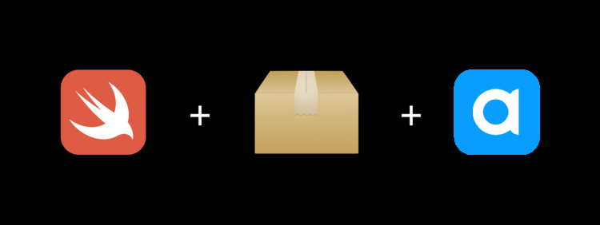

# Agora Swift Package Manager

<p align="center">
  <a href="https://docs.agora.io/en/video-calling/overview/product-overview?platform=ios">
    
  </a>
  <a href="https://api-ref.agora.io/en/video-sdk/ios/4.x/documentation/agorartckit">
    
  </a>
  <a href="https://agora-ticket.agora.io">
    
  </a>
  <br/>
  
  <a href="https://swiftpackageindex.com/AgoraIO/AgoraRtcEngine_iOS" style="text-decoration: none;">
    
  </a>
  <a href="https://swiftpackageindex.com/AgoraIO/AgoraRtcEngine_iOS">
    
  </a>
</p>

Welcome to the Agora Swift Video SDK! This package allows you to integrate powerful video capabilities into your iOS applications. You have the flexibility to choose from a variety of extensions to enhance your video communication experience.

For a complete understanding of how to use the SDK and its various extensions, please refer to the [full documentation](https://docs.agora.io/en/video-calling/overview/product-overview?platform=ios).



## Installation

To install the Agora Swift Video SDK, follow these steps:

1. Open your Xcode project.
2. Go to **File** > **Swift Packages** > **Add Package Dependency**.
3. Paste the following URL of this repository:

```
https://github.com/AgoraIO/AgoraRtcEngine_iOS
```

4. Xcode will offer you a choice of products to add. Make sure to select **`RtcBasic`** for core functionality and choose any other extensions you require.

### Available Extensions

The Agora Swift Video SDK comes with various extensions that you can use to enhance your application's video capabilities:

| Extension | Description |
|-----------|-------------|
| **RtcBasic** | Core components for real-time communication (Required). |
| **AINS** | AI noise reduction with improved human voice fidelity, noise suppression, and de-reverberation. |
| **AudioBeauty** | Bel Canto plugin with preset vocal effects and custom vocal effects settings. |
| **ClearVision** | Video enhancement plugin with basic beauty, video noise reduction, low light enhancement, and color enhancement. |
| **ContentInspect** | Video screenshot upload plugin for video content supervision. |
| **SpatialAudio** | Spatial audio plugin for simulating spatial sound effects. |
| **VirtualBackground** | Virtual background plugin for replacing or blurring backgrounds. |
| **DRM** | Copyrighted DRM music plugin for playing copyrighted music in real-time interactive scenarios. |
| **FaceDetection** | Face recognition plugin for recognizing faces or portraits. |
| **VideoCodecEnc** | Perceptual Video Coding (PVC) insert for reducing bandwidth consumption. |
| **VideoCodecDec** | PVC insert for improving video fluency in limited bandwidth scenarios. |
| **ReplayKit** | Screen sharing plugin for sharing screen content with others. |
| **VQA** | Video quality assessment plugin for scoring video quality based on subjective feelings. |
| **AIAEC** | AI echo cancellation plugin for clear near-end human voice preservation. |
| **SuperResolution** | Super resolution plugin for increasing remote video resolution. |

For more detailed information on each extension and how to use them, refer to the [official documentation](https://docs.agora.io/en/video-calling/reference/downloads?platform=ios).


## Troubleshooting

If you encounter any issues during the installation process, try the following steps:

In Xcode, go to File > Swift Packages > Reset Package Caches.

Otherwise [create a ticket](https://agora-ticket.agora.io) and our support team will get back to you ASAP.

---

Feel free to explore and utilize the wide range of features provided by the Agora Swift Video SDK to create immersive and engaging video experiences in your application!

